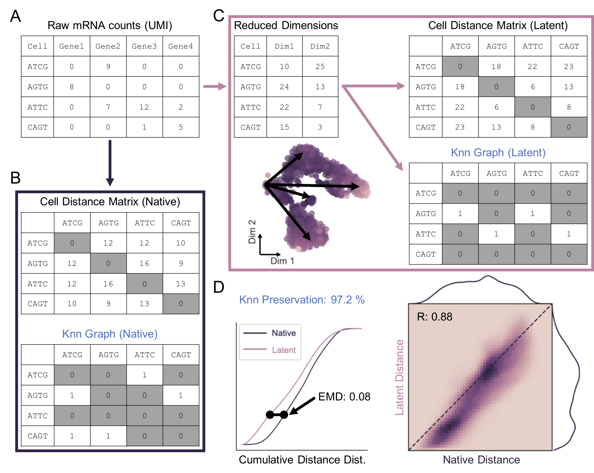

### furry-couscous: A quantitative framework for evaluating data structure preservation by dimensionality reduction techniques
High-dimensional data is integral to modern systems biology. Computational methods for dimensionality reduction are being rapidly developed for applications to single-cell and multi-modal technologies. In order to understand what these nonlinear transformations do to the underlying biological patterns in our data, we developed a framework of quantitative metrics for global and local distance preservation.  


**Figure 1.** Cell distance distributions describe global structure of high-dimensional datasets.  

---
#### Required Python Dependencies
Install using pip:  
```
pip install -r requirements.txt
```

---
#### Optional Packages
In order to use the [__"FIt-SNE"__ implementation](https://arxiv.org/abs/1712.09005) of t-SNE, you'll need to download [FFTW](http://www.fftw.org/) and compile the code from the [FIt-SNE repo](https://github.com/KlugerLab/FIt-SNE).  

For feature selection using neighborhood variance ratio, install [__NVR__ from GitHub](https://github.com/KenLauLab/NVR).  

Clone the [scvis](https://github.com/shahcompbio/scvis) and [ZIFA](https://github.com/epierson9/ZIFA) packages and install with `python setup.py install` from their home directories.  

---
#### Contents
##### `fcc_utils.py` & `fcc_utils.r`:
Contain utility functions for manipulating datasets and comparing feature-reduced latent spaces.  

##### `fcc_DRs.py`:
Defines python classes for manipulation, processing, and visualization of scRNA-seq counts data and dimensionality reduction objects.  

##### Tutorials:
Consult `fcc_classes_tutorial.ipynb` and `distance_preservation_tutorial.ipynb` for info on how to create and manipulate _RNA_counts_ and _DR_ objects, and perform global and local structure preservation analysis on low-dimensional embeddings of your own datasets.  
