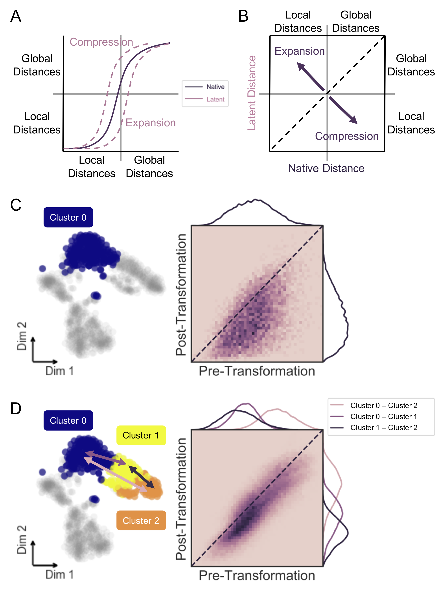

### furry-couscous: A quantitative framework for evaluating data structure preservation by dimensionality reduction techniques
High-dimensional data is integral to modern systems biology. Computational methods for dimensionality reduction are being rapidly developed for applications to single-cell and multi-modal technologies. In order to understand what these nonlinear transformations do to the underlying biological patterns in our data, we developed a framework of quantitative metrics for global and local distance preservation.  


**Figure 1.** Cell distance distributions describe global structure of high-dimensional datasets. A) Representation of gene counts matrix as output by scRNA-seq processing pipeline. B) Cell-cell Euclidean distances in native gene space are calculated to generate an m x m matrix, where m is the total number of cells. K nearest-neighbors (Knn) graph is constructed from these distances as a binary m x m matrix. C) Upon transformation to low-dimensional latent space, a distance matrix and Knn graph can be calculated as in B. D) Distance matrices from native (B) and latent (C) spaces are used to build cumulative probability density distributions, which can be compared to one another by Earth Mover’s Distance (EMD, left). Unique distances from the upper triangle of each distance matrix are correlated by Mantel test (right). Knn preservation represents element-wise comparison of nearest-neighbor graph matrices in each space.  


**Figure S1, Related to Figure 1.** Interpretation of data structure preservation analysis. A) Small distances in cumulative distance distribution represent local cell similarity (within cluster), while large distances represent global relationships and arrangement of data (between clusters). A distribution shift left indicates compression of distances from native to latent space, while a shift right results from expansion or exaggeration of native distances. B) Correlation of latent to native distances; dispersion below identity line (dashed) indicates compression of distances from native to latent space, while dispersion above identity results from expansion of native distances in low-dimensional space. C) Substructure analysis uses same framework as Figure 1 on isolated subset of data to measure intra-cluster distance preservation and determine contribution to global structure. D) Distribution of distances from all cells in one cluster to another define relative substructure. Inter-cluster distances are measured pairwise to interrogate cluster arrangement in latent compared to native space.  

---
#### Required Python Dependencies
Install using pip:  
```
pip install -r requirements.txt
```

---
#### Optional Packages
In order to use the [__"FIt-SNE"__ implementation](https://arxiv.org/abs/1712.09005) of t-SNE, you'll need to download [FFTW](http://www.fftw.org/) and compile the code from the [FIt-SNE repo](https://github.com/KlugerLab/FIt-SNE).  

For feature selection using neighborhood variance ratio, install [__NVR__ from GitHub](https://github.com/KenLauLab/NVR).  

Clone the [scvis](https://github.com/shahcompbio/scvis) and [ZIFA](https://github.com/epierson9/ZIFA) packages and install with `python setup.py install` from their home directories.  

---
#### Contents
##### `fcc_utils.py` & `fcc_utils.r`:
Contain utility functions for manipulating datasets and comparing feature-reduced latent spaces.  

##### `fcc_DRs.py`:
Defines python classes for manipulation, processing, and visualization of scRNA-seq counts data and dimensionality reduction objects.  

##### Tutorials:
Consult `fcc_classes_tutorial.ipynb` and `distance_preservation_tutorial.ipynb` for info on how to create and manipulate _RNA_counts_ and _DR_ objects, and perform global and local structure preservation analysis on low-dimensional embeddings of your own datasets.  
